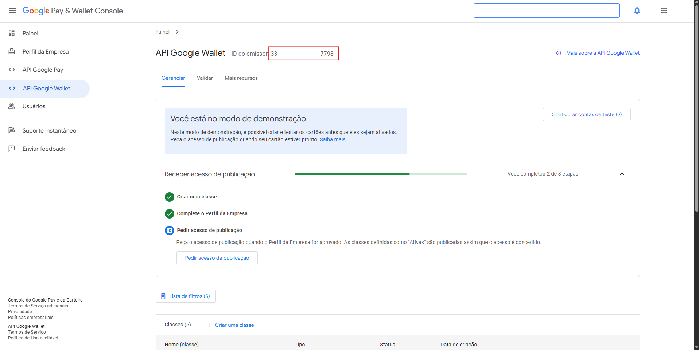
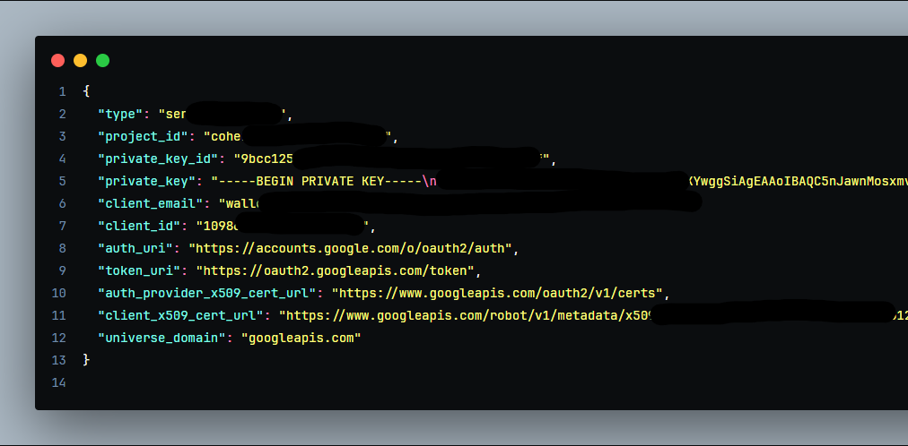

# Google Wallet Web Teste

Este projeto demonstra como criar e emitir cartões customizados no Google Wallet usando Next.js (app router), Server Actions e a API do Google Wallet.

### Preencha o arquivo .env com as suas chaves da api Google Wallet que você obteve através do google console.

**Como consigo uma chave de emissor?**

- siga esse tutorial do google: [https://developers.google.com/wallet?hl=pt-br](https://developers.google.com/wallet?hl=pt-br)



### Tecnologias

Next.js 14+ (App Router);
React Server Actions (useActionState);
TypeScript;
Tailwind CSS;
Node.js 18+;

### Pré-requisitos

* Conta de desenvolvedor Google Wallet com issuerId válido
* Arquivo credentials.json no root com as credenciais da API
* Node.js instalado (>= 18)

### Instalação

#### Clone o repositório:

`git clone https://github.com/CauaYves/Google-Wallet.git`

#### Instale dependências:

`npm install`

#### Crie um arquivo .env.local na raiz com as variáveis:

```
NEXT_PUBLIC_BASE_URL=http://localhost:3000
GOOGLE_WALLET_ISSUER_ID=seu.issuerId
```

#### Adicione seu credentials.json (fornecido pelo Google) no root:



### Estrutura

**/app/page.tsx** – Formulário UI para entrada de dados

**/app/actions.ts** – Server Action que:

* Cria (ou garante) a classe no Google Wallet
* Gera objeto (pass) e retorna a URL para salvar

**/app/api/wallet/class/route.ts** – Endpoint de criação de Classe

**/app/api/wallet/object/route.ts** – Endpoint de criação de Objeto

#### Configuração do Formulário

* No page.tsx, preencha:
* E-mail
* ID da classe (ex: minhaClasse → issuerId.minhaClasse)
* Título
* Subtítulo
* Data
* Validade
* URL da Imagem Principal
* URL da Logo
* Cor de fundo (hex)

**Ao submeter, a Server Action:**

* Chama /api/wallet/class (cria/clona a classe)
* Chama /api/wallet/object (cria pass e gera JWT)
* Exibe botão que aponta para URL do Google Wallet

**API Routes**

*/api/wallet/class (POST)*

* Recebe JSON com: id: `<issuerId>`.`<classId>, `classTemplateInfo, imageModulesData, textModulesData

> Retorna 201 (criado) ou 200 se já existir

*/api/wallet/object (POST)*

* Recebe JSON completo do objeto (incluindo id, classId, heroImage, logo, etc.)
* Gera JWT savetowallet

> Retorna { saveUrl } (link para salvar no Wallet)

### Scripts disponíveis

**npm run dev** # Inicia em modo desenvolvimento
**npm run build** # Gera build de produção
**npm run start** # Inicia app em produção

**Observações**

GOOGLE_WALLET_ISSUER_ID deve ser idempotente e corresponder ao issuerId do Google

IDs de objetos são gerados com UUID para evitar colisões

**⚠️ credentials.json não deve ser versionado em repositório público**
